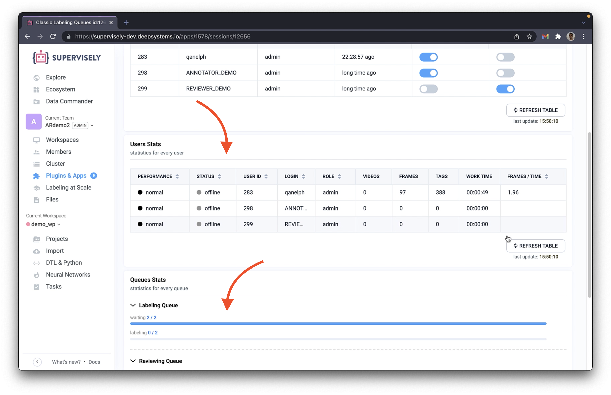
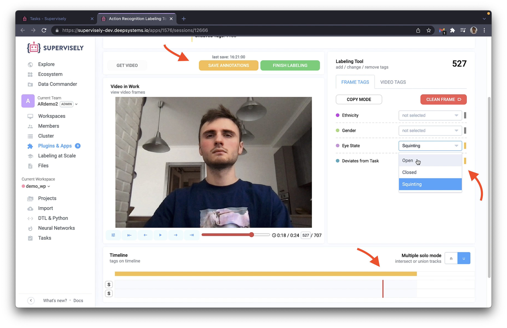
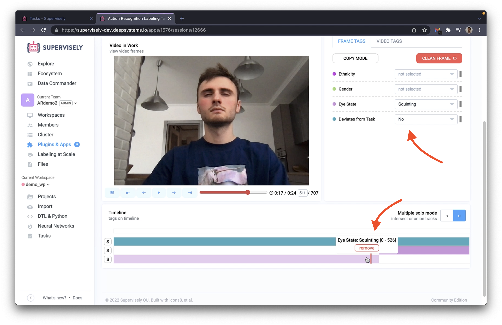
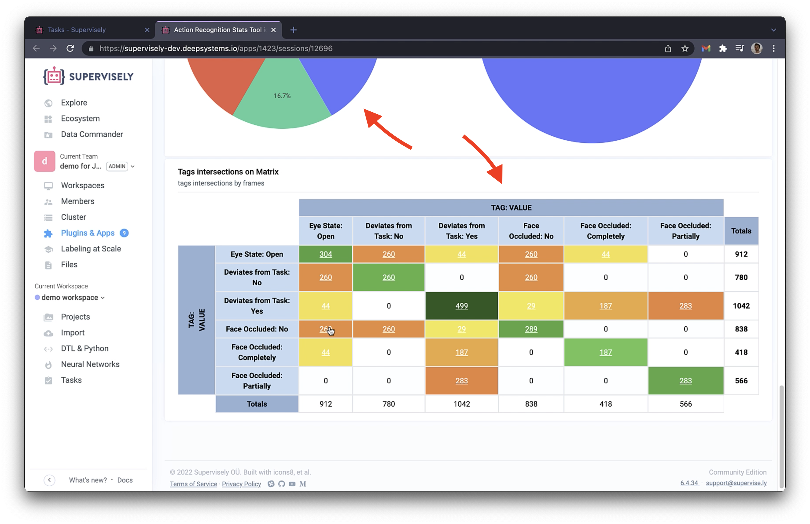

  
<h1 align="center" style="border-bottom: 0"> 🎬 Action Recognition Collection </h1>

  
<b>Label and Review videos for Action Recognition task</b>

  

  <a href="#Overview">Overview</a> •
  <a href="#Applications">Applications</a> •
  <a href="#Demo-Data">Demo Data</a> •
  <a href="#For-Developers">For Developers</a> •
  <a href="#About-Us">About Us</a>

  

## Overview

This collection allows you to label, review and process data in Action Recognition task   

<table>
    <tr style="width: 100%">
        <td >
          
            <h4 align="center" style="font-family:'Lucida Console', monospace; padding-top: 3px; padding-bottom: 0">control labeling process</h4>
        </td>
        <td>
          
            <h4 align="center" style="font-family:'Lucida Console', monospace; padding-top: 3px; padding-bottom: 0">label videos using simple and powerfull software</h4> 
        </td>
    </tr>
    <tr>
        <td>
          
            <h4 align="center" style="font-family:'Lucida Console', monospace; padding-top: 3px">review labeled videos</h4> 
        </td>
        <td>
          
            <h4 align="center" style="font-family:'Lucida Console', monospace; padding-top: 3px">comfortably analyze stats on labeled project</h4> 
        </td>
    </tr>
    
</table>

## Applications

- [Classic Labeling Queues](https://ecosystem.supervise.ly/apps/labeling-queues) — use this Application to initialize Annotation Process   
  
  
- [Action Recognition Labeling](https://ecosystem.supervise.ly/apps/action-recognition-labeling) — use this Application to label and review data  

    

- [Action Recognition Stats Tool](https://ecosystem.supervise.ly/apps/action-recognition-stats) — use this Application to analyze labeled project  
  
    
## Demo Data
 
- [Videos example](https://ecosystem.supervise.ly/projects/videos-example) — videos for test

    

# For Developers

You can use sources from any application to create your own.

You can also refer to our documentation:

- [How to create Superivsely APP](https://github.com/supervisely-ecosystem/how-to-create-app)
- [Learn SDK Basics with IPython Notebooks](https://sdk.docs.supervise.ly/rst_templates/notebooks/notebooks.html)
- [Complete Python SDK](https://sdk.docs.supervise.ly/sdk_packages.html)

# About us

You can think of [Supervisely](https://supervise.ly/) as an Operating System available via Web Browser to help you solve
Computer Vision tasks. The idea is to unify all the relevant tools that may be needed to make the development process as
smooth and fast as possible.

More concretely, Supervisely includes the following functionality:

- Data labeling for images, videos, 3D point cloud and volumetric medical images (dicom)
- Data visualization and quality control
- State-Of-The-Art Deep Learning models for segmentation, detection, classification and other tasks
- Interactive tools for model performance analysis
- Specialized Deep Learning models to speed up data labeling (aka AI-assisted labeling)
- Synthetic data generation tools
- Instruments to make it easier to collaborate for data scientists, data labelers, domain experts and software engineers

One challenge is to make it possible for everyone to train and apply SOTA Deep Learning models directly from the Web
Browser. To address it, we introduce an open sourced Supervisely Agent. All you need to do is to execute a single
command on your machine with the GPU that installs the Agent. After that, you keep working in the browser and all the
GPU related computations will be performed on the connected machine(s).

- for technical support please leave issues, questions or suggestions in
  our [repo](https://github.com/supervisely-ecosystem/gl-metric-learning). Our team will try to help.
- also we can chat in slack
  channel 
- if you are interested in Supervisely Enterprise Edition (EE) please send us
  a [request](https://supervise.ly/enterprise/?demo) or email Yuri Borisov at [sales@supervise.ly](sales@supervise.ly)
